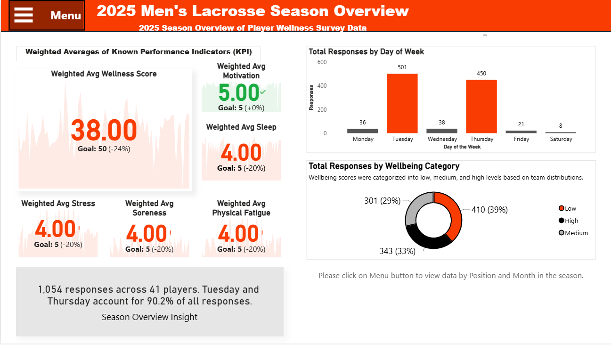
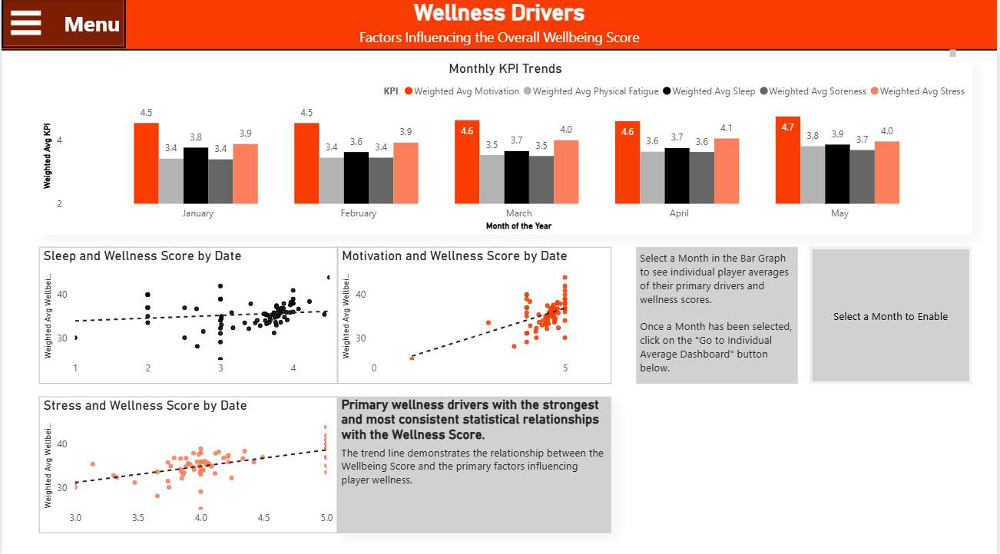
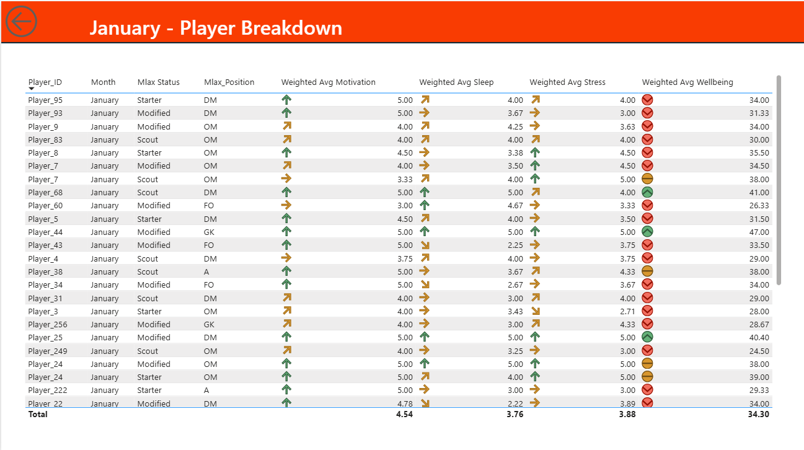
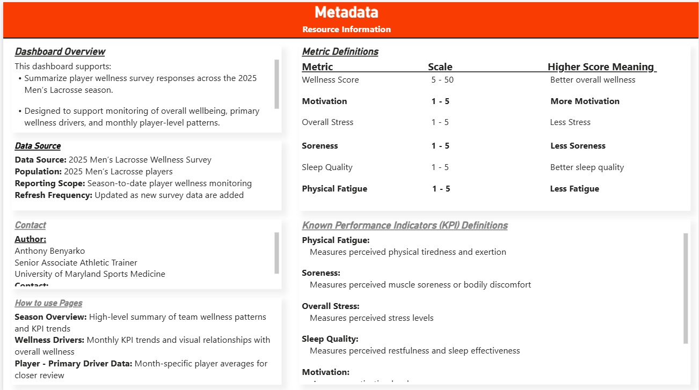
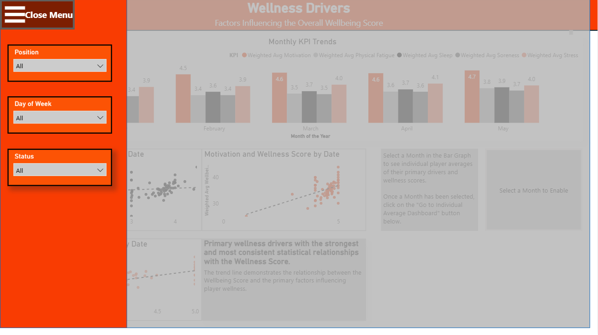
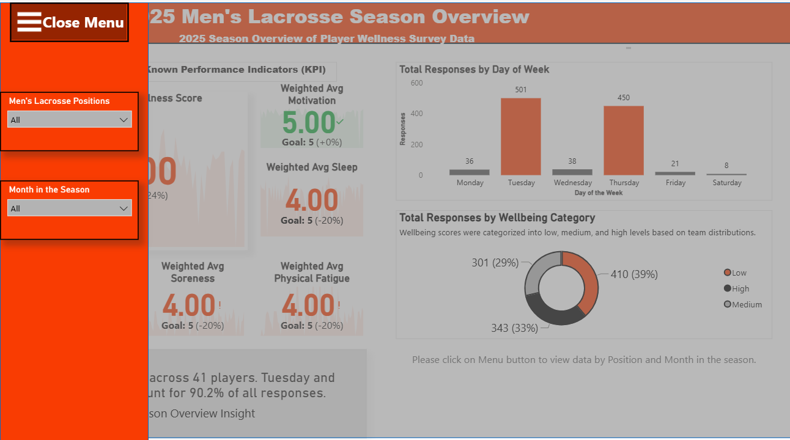

# 🥍 Sports-Wellness-Analytics

 <b>Survey Statistics - Decision Science - Business Intelligence - R<b>

---

**Developed an end-to-end analytics pipeline using survey-weighted statistics, machine learning, and Power BI to support athlete wellness monitoring and evidence-based performance decisions.**

## Executive Summary

The primary objective is to assess player wellness using five known performance indicators (KPIs): sleep quality, motivation, overall stress, physical fatigue, and soreness. The analysis distinguishes primary drivers, secondary drivers, and supporting indicators of wellness, while identifying meaningful differences across playing positions.

Using daily wellness survey data collected throughout an NCAA Division I men's lacrosse season, I developed an end-to-end analytics pipeline that transforms subjective athlete wellness responses into a longitudinal decision-support framework that supports proactive, evidence-based decision-making.

The project integrates survey-weighted statistical methods, bootstrapping, regression modeling, and interactive Power BI dashboards to identify the primary drivers of athlete wellness and support proactive decision-making.

---

## Business Problem

Athlete wellness is dynamic rather than static.

Traditional monitoring often relies on isolated survey responses that provide only a snapshot of how an athlete feels on a given day.

This project addresses that limitation by developing a longitudinal decision-support framework that monitors wellness trends over time, enabling earlier identification of meaningful changes in athlete readiness.

The objective of this project was to develop a repeatable analytics framework capable of:

- Monitoring athlete wellness
- Identifying key wellness drivers
- Understanding position-specific differences
- Supporting evidence-based recovery decisions
- Providing executive-ready dashboards for coaches and sports performance staff

---

## Research Questions

This project answers several key questions:

- Which wellness indicators most strongly influence athlete wellbeing?
- Do wellness patterns differ across playing positions?
- How does athlete wellness change throughout the training week?
- Can survey-weighted statistical methods improve interpretation?
- How can wellness data support proactive recovery planning?

---

## Data

- NCAA Division I Men's Lacrosse Wellness Survey
- 1,054 daily wellness responses
- Five wellness indicators:
  - Sleep Quality
  - Motivation
  - Overall Stress
  - Physical Fatigue
  - Soreness

All player data was anonymized prior to analysis.

---

## Methodology

This project combines traditional statistical analysis with modern analytics techniques.

### Data Preparation

- Data cleaning
- Standardization
- Anonymization
- Feature engineering

### Survey Statistics

- Survey-weighted analysis
- Raking
- Bootstrap weights
- Confidence intervals

### Statistical Analysis

- Bootstrap estimation
- Rao–Scott Chi-Square Tests
- Survey-weighted GLM
- Position interaction models

### Business Intelligence

- Power BI Dashboard
- Executive KPIs
- Drill-through reports
- Interactive visualizations

---

# Key Findings

## Primary Drivers

The strongest predictors of athlete wellness were:

- 😴 Sleep Quality
- 💪 Motivation
- 📉 Overall Stress

These variables demonstrated the most consistent relationships with overall wellbeing.

---

## Secondary Drivers

Additional significant contributors included:

- Physical Fatigue
- Soreness

Although important, these variables showed smaller effects than the primary drivers.

---

## Position-Specific Findings

Survey-weighted analyses identified meaningful differences across playing positions.

Examples include:

- Defense players showed a stronger relationship between motivation and wellness.
- Goalkeepers reported the highest sleep quality.
- Faceoff specialists demonstrated lower overall wellness scores.
- Position-specific responses suggest individualized recovery strategies may be beneficial.

---

## Weekly Wellness Trends

Mid-week wellness monitoring emerged as the most valuable period for assessing athlete readiness. However, evaluating Tuesday and Thursday wellness scores in isolation only provides a snapshot of how an athlete feels on a given day. The true value lies in tracking the **change** in individual wellness scores throughout the week and across the season.

Monitoring these changes enables coaches and sports medicine staff to identify meaningful shifts in athlete readiness, evaluate recovery trajectories, and intervene before declines in performance or health become more pronounced.

Expanding wellness monitoring to additional days throughout the week will provide a more complete picture of training response, competition readiness, and post-game recovery while improving the accuracy of long-term trend analysis.

### Recommendations

- Use Tuesday as the weekly baseline for athlete wellness.
- Compare Tuesday and Thursday wellness scores to identify meaningful changes in readiness.
- Use Thursday as the primary decision point for training load and recovery adjustments.
- Add Friday wellness surveys to assess pre-game readiness.
- Add Sunday wellness surveys to evaluate post-game recovery.
- Flag athletes whose wellness scores decline meaningfully from Tuesday to Thursday for targeted interventions.
- Increase survey frequency to improve longitudinal monitoring throughout the season.
- Use individual wellness trends—not single-day scores—to guide personalized recovery strategies.

Ultimately, the objective is not to identify athletes who report a low wellness score on a single day, but to identify meaningful changes in individual wellness trajectories that support proactive, evidence-based decisions.

---

## Dashboard

The accompanying Power BI dashboard enables coaches and sports medicine staff to:

- Monitor athlete wellness
- Compare playing positions
- Track trends over time
- Identify athletes requiring intervention
- Explore interactive drill-through reports

### Executive Season Overview

The Executive Season Overview provides coaches and sports performance staff with a high-level summary of athlete wellness across the season. Key performance indicators (KPIs), wellness distributions, and survey participation trends allow decision-makers to quickly assess overall team health.

  

---

### Wellness Drivers Dashboard

This page explores the relationships between the primary wellness indicators and the overall Wellbeing Score. Interactive trend visualizations help identify which factors have the strongest influence on athlete wellbeing and support evidence-based recovery decisions.

  

---

### Individual Player Analysis

After selecting a month, users can drill down to individual athlete performance, comparing weighted averages across wellness indicators and identifying athletes who may benefit from targeted interventions.

  

---

### Metadata & KPI Definitions

The dashboard includes embedded metadata describing data sources, KPI definitions, reporting frequency, and business rules to improve transparency and ensure consistent interpretation across users.

  

---

### Interactive Dashboard Filters

Users can dynamically filter dashboard results by playing position, athlete status, day of the week, and month, allowing coaches and sports medicine staff to tailor analyses to specific athlete groups and reporting periods.

  

---

### Dashboard Navigation

Navigation controls provide quick access to the Executive Season Overview, Wellness Drivers analysis, and individual player drill-through pages, enabling users to move seamlessly between strategic and operational views.

  

---

## Technologies

- R
- Survey Package
- tidyverse
- ggplot2
- Power BI
- DAX
- Git
- GitHub

---

## Business Impact

Rather than treating wellness surveys as isolated daily check-ins, this framework transforms repeated observations into longitudinal evidence that supports proactive decision-making.

The result is a scalable decision-support system capable of identifying emerging trends before they become performance or health concerns.

The resulting framework supports:

- Evidence-based coaching decisions
- Individualized recovery strategies
- Improved monitoring consistency
- Enhanced communication between sports medicine and coaching staff
- A scalable foundation for predictive athlete readiness

---

## Lessons Learned

This project reinforced that the value of analytics is not found in producing reports—it is found in designing systems that enable better decisions.

One of the most important outcomes was recognizing that monitoring longitudinal changes in athlete wellness provides significantly greater value than interpreting isolated daily observations.

This insight fundamentally changed the direction of the project and established the foundation for future predictive athlete monitoring.

#### Choosing Meaningful Predictive Models

One of the most valuable lessons from this project was recognizing the importance of selecting analytical methods that answer meaningful research questions rather than simply producing statistically significant results.

Early in the analysis, linear regression models were developed using the Wellbeing Score as the dependent variable and the individual wellness indicators as predictors. While these models produced statistically significant results, the Wellbeing Score is derived directly from these same indicators, making the predictive relationship largely expected rather than informative.

Although incorporating player position and interaction effects provided meaningful insights into how wellness relationships differed across positions, it did not eliminate the underlying dependence between the predictors and the outcome. This distinction reinforced the importance of separating exploratory analyses, which help explain existing relationships, from predictive models, which should evaluate independent outcomes.

Moving forward, predictive modeling efforts will focus on objective performance and readiness measures—such as countermovement jump (CMJ), reactive strength index (RSI), Catapult workload metrics, and other external performance indicators—to generate more meaningful, actionable insights that support evidence-based decision-making.

---

## Future Development

Future work will extend the longitudinal decision-support framework through the folowing enhancements:

- Integration of Catapult GPS workload metrics
- Integretion of CMJ, RSImod, and VALD performance testing.
- Athlete monitoring platform capable of predicting readiness and supporting proactive interventions.
- Predictive machine learning models
- R Shiny applications
- Real-time wellness monitoring
- AI-assisted decision support

### Methodological Enhancements

One of the most important findings from this project was methodological rather than statistical.

While Tuesday and Thursday surveys provided valuable snapshots of athlete wellness, the analysis demonstrated that single-day observations alone do not fully capture athlete readiness. The greatest value lies in monitoring changes in individual wellness scores over time rather than interpreting isolated responses.

Future iterations of this framework will transition from point-in-time monitoring to a longitudinal decision-support framework by:

- Monitoring changes in individual wellness scores throughout the week rather than relying on single-day observations.
- Expanding wellness data collection to include Friday (pre-game readiness) and Sunday (post-game recovery).
- Tracking athlete wellness trajectories across the entire season to identify meaningful deviations from individual baselines.
- Developing individualized readiness thresholds using longitudinal trends rather than population averages.
- Integrating subjective wellness measures with objective performance metrics (CMJ, RSI, Catapult, and VALD) to improve predictive decision-making.

The long-term vision is to evolve this project from a wellness reporting system into a longitudinal decision-support framework that proactively identifies meaningful changes in athlete readiness and supports evidence-based intervention strategies.

---

## Why This Project Matters

Organizations often collect data without developing systems that transform those observations into meaningful decisions.

This project demonstrates how a longitudinal decision-support framework can convert routine wellness surveys into an evidence-based process for monitoring change, identifying emerging risks, and supporting proactive interventions.

Although developed within collegiate athletics, the framework is transferable to healthcare, higher education, occupational health, military readiness, and other environments where continuous monitoring informs operational decisions.

---

## Project Deliverables

This project includes multiple deliverables tailored to both executive and technical audiences.

### Decision Support Dashboard
An interactive Power BI dashboard that transforms complex statistical analyses into intuitive visualizations for coaches, sports performance professionals, and organizational stakeholders. The dashboard supports longitudinal athlete wellness monitoring through executive KPIs, wellness trend analysis, player-level drill-through reports, and interactive filtering designed to facilitate evidence-based decision-making.

📊 **Dashboard screenshots are displayed throughout this README.**

### Executive Summary
A concise overview of the project's objectives, key findings, business impact, and strategic recommendations for organizational leaders.

📄 **[View Executive Summary](executive-summary/Executive-Summary-MLAX-Player-Wellness-Survey-Analysis-2025.pdf)**

### Technical Report
A comprehensive report documenting the analytical methodology, statistical analyses, survey-weighting procedures, findings, and future development of the longitudinal decision-support framework.

📄 **[View Technical Report](report/MLAX-Player-Wellness-Survey-Analysis-2025.pdf)**

---

## Project Vision Statement

***This project reflects my passion for building analytics ecosystems that move organizations beyond reporting toward proactive, evidence-based decision-making through longitudinal decision-support frameworks.***

---

## Repository Structure

📂 analysis/

📂 dashboard/

📂 executive-summary/

📂 modeling/

📂 report/

📂 visuals/

README.md

---

## Author

Anthony Benyarko

Data Analytics Professional specializing in survey statistics, predictive analytics, business intelligence, and decision science.

### Skills Demonstrated

- Survey Methodology
- Survey-Weighted Statistics
- Bootstrap Estimation
- Rao–Scott Chi-Square Testing
- Regression Modeling
- Data Visualization
- Power BI Development
- Executive Dashboard Design
- Decision Support Systems
- Business Intelligence

LinkedIn:
https://linkedin.com/in/anthony-benyarko
